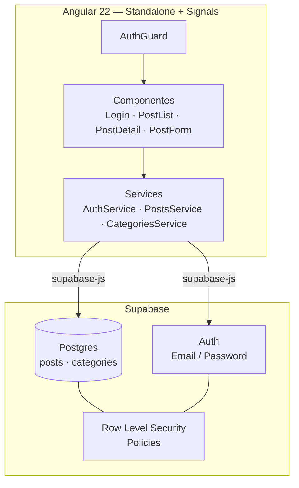
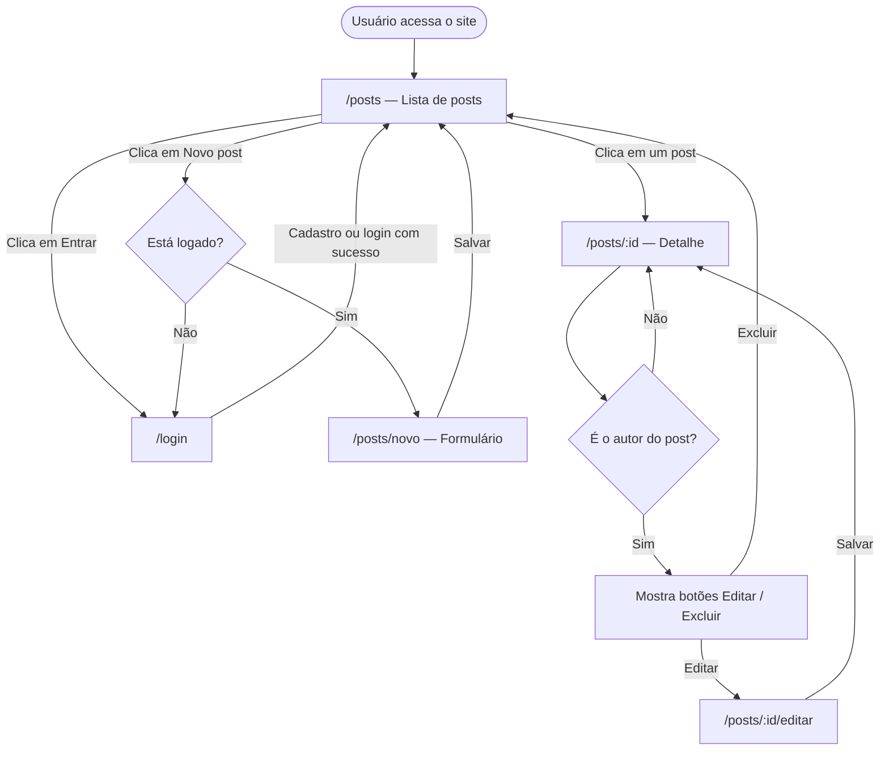
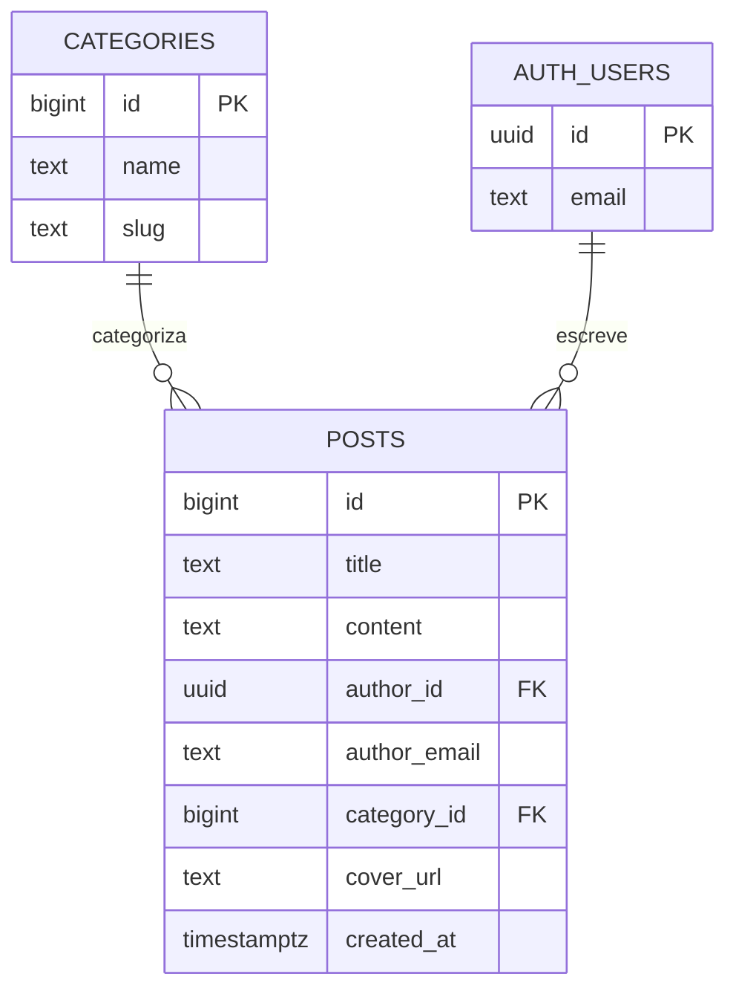

# Blog Angular + Supabase

Projeto de estudo: um blog com autenticação, categorias e capa de post, construído com **Angular 22** (standalone components + signals) e **Supabase** (Postgres + Auth + Row Level Security) como backend.

> Para o histórico completo de decisões técnicas, código de cada arquivo e bugs já resolvidos, veja [`project-context.md`](./project-context.md).

## Funcionalidades

- Listagem pública de posts, com capa e categoria
- Filtro de posts por categoria (Economia, Esportes, Entretenimento, Automotivo)
- Cadastro / login de usuários
- CRUD de posts — só o autor edita ou exclui o próprio post
- Capa do post opcional, com fallback abstrato gerado no front quando não há imagem

## Stack

| Camada | Tecnologia |
|---|---|
| Frontend | Angular 22 (standalone + signals), Angular Material |
| Backend | Supabase (Postgres, Auth, Row Level Security) |
| Client | `@supabase/supabase-js` |

## Arquitetura



A segurança roda em duas camadas: o `AuthGuard` cuida da experiência (esconde rotas de quem não está logado), e o **RLS no Postgres** garante a regra de verdade — mesmo que alguém burle o frontend, o banco nunca permite editar ou excluir um post que não é seu.

## Fluxo de navegação



## Modelo de dados



`categories` tem 4 linhas fixas (Economia, Esportes, Entretenimento, Automotivo), sem CRUD pela interface. `posts.author_id` referencia `auth.users`, a tabela interna de usuários do Supabase Auth.

## Configuração e execução local

### 1. Pré-requisitos

- Node.js 22+ (testado com 24.0.2)
- Conta no [Supabase](https://supabase.com)

### 2. Clonar e instalar

```bash
git clone <url-do-repositorio>
cd blog-angular
npm install
```

### 3. Configurar o Supabase

1. Crie um projeto no Supabase.
2. No **SQL Editor**, rode o schema completo (tabelas `posts`, `categories`, policies de RLS) — disponível em [`project-context.md`](./project-context.md#3-configuração-do-supabase-já-feita).
3. Em **Project Settings → Data API**, copie a **Project URL** e a **Publishable key**.

### 4. Configurar as variáveis de ambiente

Edite `src/environments/environment.ts` e `src/environments/environment.development.ts`:

```ts
export const environment = {
  production: true, // false no .development.ts
  supabaseUrl: 'SUA_PROJECT_URL',
  supabaseKey: 'SUA_PUBLISHABLE_KEY'
};
```

> A publishable key é segura para expor no client — a proteção real é o RLS configurado no banco.

### 5. Rodar em desenvolvimento

```bash
ng serve
```

Acesse `http://localhost:4200`.

### 6. Build de produção

```bash
ng build
```

Os arquivos compilados ficam em `dist/`.

## Estrutura de pastas

```
src/app/
├── core/        # Services e guard (Auth, Posts, Categories, Supabase)
├── shared/      # Componentes reutilizáveis (capa do post)
└── features/
    ├── auth/    # Login / cadastro
    └── posts/   # Listagem, detalhe e formulário de posts
```
